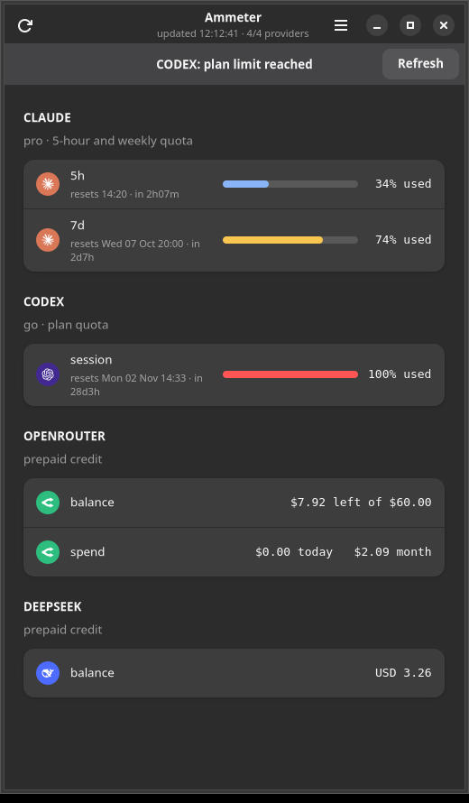

# Ammeter

One meter for the usage, credits and quota limits of your AI accounts — as a native desktop app and
as a GNOME top-bar indicator.



An ammeter measures the current flowing through a circuit. This one measures what your Claude Code,
Codex, OpenRouter and DeepSeek accounts are drawing: session and weekly quota with reset times and
countdowns, plus the prepaid balances that quietly run dry.

## Why another usage monitor

- **It uses the logins you already have.** Claude Code and Codex keep an OAuth login on disk and the
  same usage endpoints their own CLIs read; OpenRouter and DeepSeek are queried with the API keys
  Hermes already stores. No dashboard login, no browser cookies, no screenshot scraping, no
  telemetry — nothing leaves the machine.
- **It survives a rate limit.** Claude's endpoint answers `429` when polled hard, so every provider's
  last good answer is cached on disk: a fresh process (the CLI, the extension, a second app window)
  still shows the previous numbers, labelled with the reason, instead of an error.
- **It knows when a number went stale.** Each quota row carries the window's reset timestamp. If a
  cached window already rolled over, the percentage is dropped and replaced with
  *awaiting fresh numbers* — showing a number that is known to be wrong is worse than showing none.
- **One data layer, three front-ends.** The app, the tkinter floating window and the GNOME extension
  all render the same normalised rows from `ammeter/core.py`; nothing is formatted twice.

## Providers

| Provider | Credential it reads | Endpoint | What it shows |
|---|---|---|---|
| **Claude** | `~/.claude/.credentials.json` | `GET api.anthropic.com/api/oauth/usage` | 5-hour and weekly quota, per-model weekly buckets, reset times |
| **Codex** | `~/.codex/auth.json` | `GET chatgpt.com/backend-api/wham/usage` | session and weekly rate limits, plan, reset times, credits |
| **OpenRouter** | `OPENROUTER_API_KEY` in `~/.hermes/.env` | `GET openrouter.ai/api/v1/credits` + `/key` | credit balance, today's and this month's spend |
| **DeepSeek** | `DEEPSEEK_API_KEY` in `~/.hermes/.env` | `GET api.deepseek.com/user/balance` | credit balance |

Quota providers get a bar that turns amber at 70% and red at 90%; pay-as-you-go providers get their
balance, because a percentage of a top-up you can refill is not the same thing as a quota you cannot.

Numbers are never ambiguous about direction: every percentage is **consumption**, and reads
`33% used` — the bar fills as the quota is spent, so nothing has to be inferred from a bare `33%`.
The prepaid providers report money instead of a percentage for the same reason.

## Hiding providers

Only providers that are set up (a login or API key found) are shown. To hide one you do not want,
open the **Filters** tab in the app and switch it off; it applies at once, without a refetch. The
choice is saved in `~/.config/ammeter/hidden.json` (`{"providers": ["deepseek"]}`) and also applies
to `--text`, `--json` and the floating window.

## Install

Requirements: a Linux desktop with Python 3.10+; PyGObject with `Gtk-4.0` and `Adw-1.0` for the app
(Ubuntu 24.04+ and Fedora ship them), `python3-tk` only for `--float`, and `gjs` only for the tests.

```sh
git clone git@github.com:Cividati/ammeter.git ~/Development/ammeter
cd ~/Development/ammeter
./scripts/install.sh          # symlinks the command, the desktop entry and the GNOME extension
ammeter                       # or launch "Ammeter" from the app grid
```

`install.sh` uses symlinks on purpose: edit the checkout and the installed command follows. Use
`./scripts/install.sh --undo` to remove everything it created.

If your checkout is not at `~/Development/ammeter`, change `SCRIPT` at the top of
`gnome-extension/extension.js` to the path of your `bin/ammeter`.

## Usage

```sh
ammeter              # native GTK4 + libadwaita app
ammeter --float      # frameless, always-on-top tkinter window (see the note below)
ammeter --text       # plain snapshot for a terminal
ammeter --json       # machine-readable; this is what the GNOME extension consumes
ammeter --selftest   # formatting, window expiry, stale and cache fallback; no network
ammeter --version
```

```
✳  CLAUDE  (pro)
     5h        33% used  ▓▓▓▓░░░░░░░░  resets 14:20 · in 2h07m
     7d        74% used  ▓▓▓▓▓▓▓▓▓░░░  resets Wed 07 Oct 20:00 · in 2d7h
◆  CODEX  (go)
     session  100% used  ▓▓▓▓▓▓▓▓▓▓▓▓  resets Mon 02 Nov 14:33 · in 28d3h
⇄  OPENROUTER
     balance  $7.92 left of $60.00
     spend    $0.00 today   $2.09 month
◉  DEEPSEEK
     balance  USD 3.26

4/4 providers · Ammeter 0.3.0 · refreshed every 120s
```

## GNOME top-bar indicator

The extension shows a gauge icon that turns amber at 70% and red at 90% (or when a plan limit is
reached, or data is stale); clicking it lists every provider, the same rows the app renders.

GNOME Shell loads extensions when the session starts and Wayland cannot reload it in place, so after
installing: **log out and back in**, then check

```sh
gnome-extensions info ammeter@cividati      # State: ACTIVE
journalctl --user -b -o cat /usr/bin/gnome-shell | grep -i ammeter
```

## Architecture

```
bin/ammeter              launcher: makes the package importable, hands over to ammeter.cli
ammeter/
  __init__.py            version, app id, palette, icon names
  providers.py           one fetcher per provider, each returning a normalised entry
  formatting.py          pure helpers: bars, reset times, severities, error wording
  core.py                collect(), visible(), the row schema, stale handling, expired-window rule
  cache.py               last-good cache on disk (~/.cache/ammeter/last-good.json)
  filters.py             hidden providers, saved in ~/.config/ammeter/hidden.json
  cli.py                 arguments, --text/--json/--selftest, launches a front-end
  gtk_app.py             GTK4 + libadwaita app (Adw.PreferencesGroup per provider)
  float_window.py        tkinter always-on-top window
  ui.css                 stylesheet, with {colour} placeholders filled from __init__.py
gnome-extension/         top-bar indicator (uuid ammeter@cividati)
data/                    desktop entry and the provider/app icons
docs/screenshot.png      the image at the top of this file
scripts/                 install.sh, fetch-icons.py, enable-extension.py, grab-x11.py
tests/                   test-format.js (gjs), icon-check.py, glyph-check.py
```

Dependencies point one way — `formatting` ← `providers` ← `core` ← `cli`/front-ends — so the data
layer has no UI imports and the UI has no HTTP code. Each provider entry is a plain dict:

```python
{"key": "claude", "name": "CLAUDE", "sub": "pro",
 "rows": [{"label": "5h", "pct": 25, "reset": "2026-10-05T13:20:00+00:00",
           "note": "resets 14:20 · in 2h17m"}],
 "stale": True, "why": "rate limited (HTTP 429)"}   # only when degraded
```

Add a provider by writing one `fetch_*()` in `providers.py` and adding it to `PROVIDERS`, plus a
colour in `__init__.py` and an icon in `data/icons/` — every front-end picks it up.

## Tests

```sh
ammeter --selftest                            # pure Python, no network
/usr/bin/python3 tests/icon-check.py          # svgs parse; every icon name resolves
gjs -m tests/test-format.js                   # extension formatting against the real --json output
```

The GTK app and the extension cannot be unit-tested headlessly, so they are verified by rendering
them: `scripts/grab-x11.py` screenshots an X server, and the app runs under `xvfb-run` with
`GDK_BACKEND=x11 GSK_RENDERER=cairo` and no session bus. That is how `docs/screenshot.png` is made.

## Notes and pitfalls

- **Claude's usage endpoint rate-limits hard.** `429` with no `Retry-After`; in testing it cleared in
  two to three minutes. Hence the 120 s interval and the two-layer last-good cache. Stale blocks are
  labelled with the reason, e.g. `— stale (rate limited (HTTP 429))`.
- **The Codex endpoint is not a public API** (`chatgpt.com/backend-api/wham/usage`), and
  `~/.codex/auth.json` / `~/.claude/.credentials.json` are secrets — never log or commit them.
- **GTK4 cannot pin a window on Wayland**: there is no keep-above API, so the GTK app is a normal
  decorated window and `--float` remains the pinned option (tkinter, via XWayland).
- **PyGObject is rarely on the interpreter that `env python3` finds.** Here it exists only on
  `/usr/bin/python3`, so the GTK app is launched explicitly on that interpreter and the data layer
  deliberately stays stdlib-only so the CLI works anywhere.
- **A unique `GApplication` exits silently with no session bus** — no window, no traceback, empty
  log. Ammeter falls back to `NON_UNIQUE` when `DBUS_SESSION_BUS_ADDRESS` is unset, which is what
  makes headless screenshots possible. The same rule means a second launch is forwarded to the
  running instance, so restart the app to pick up code changes.
- **`Adw.PreferencesPage` scrolls and clamps itself**; wrapping it in `Adw.Clamp` or a
  `ScrolledWindow` breaks its height allocation. Swap a freshly built page in with
  `Adw.ToolbarView.set_content()` to refresh.
- **Icons are shipped svgs, not font glyphs.** The provider marks come from
  [simple-icons](https://simple-icons.org) (CC0-1.0) via `scripts/fetch-icons.py`; a unicode star in
  a coloured circle depends on the running font and quietly becomes a placeholder when it is missing.
  `tests/glyph-check.py` exists for the tkinter front-end, which cannot load svg.

## Licence

MIT — see [LICENSE](LICENSE). The provider marks in `data/icons` are from simple-icons (CC0-1.0);
Claude, Codex, OpenRouter and DeepSeek are trademarks of their respective owners, used here only to
identify the accounts being measured.
