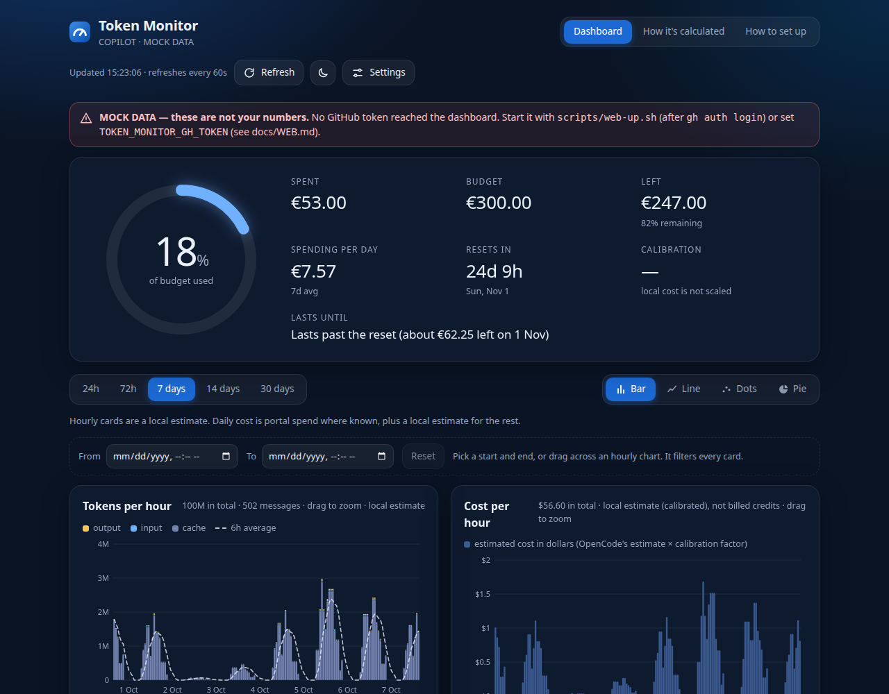
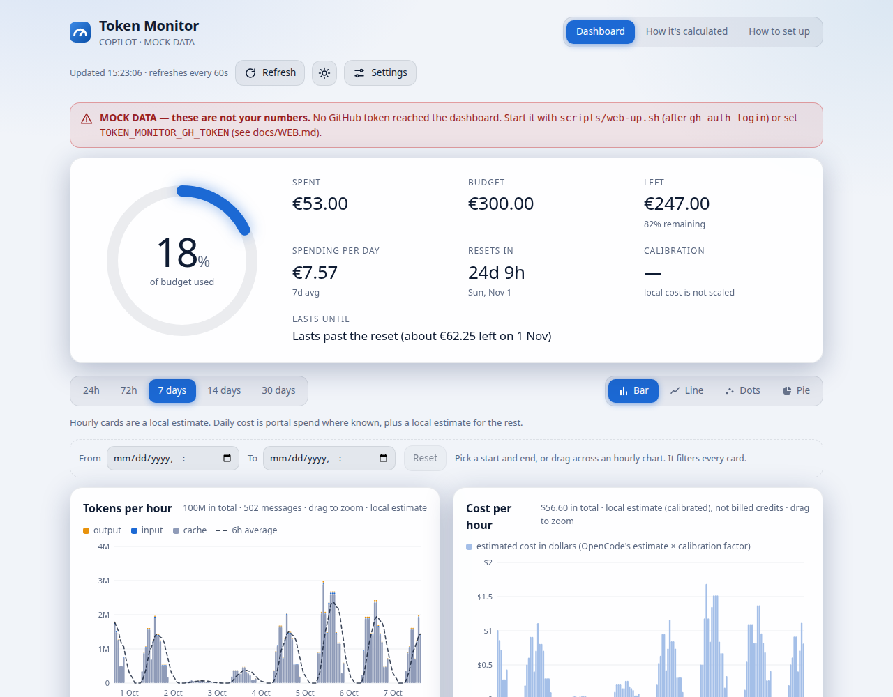
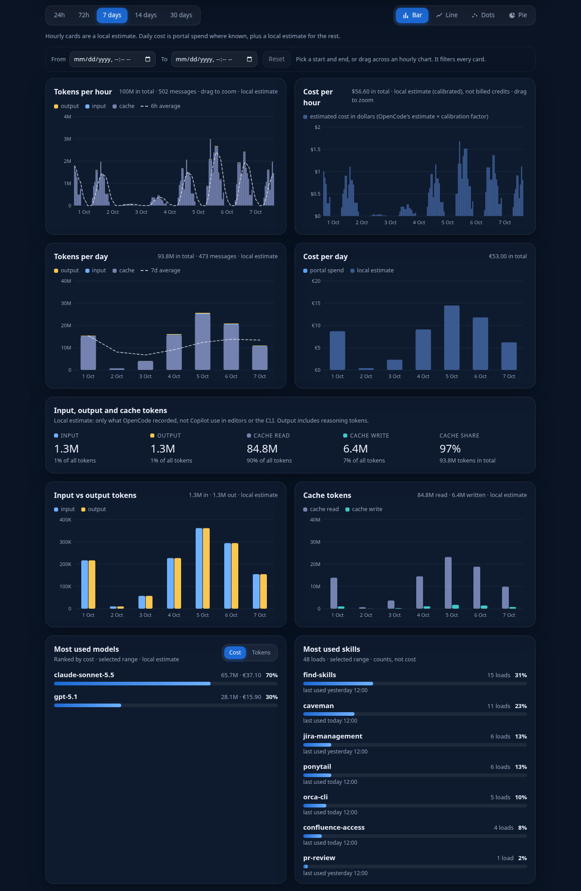
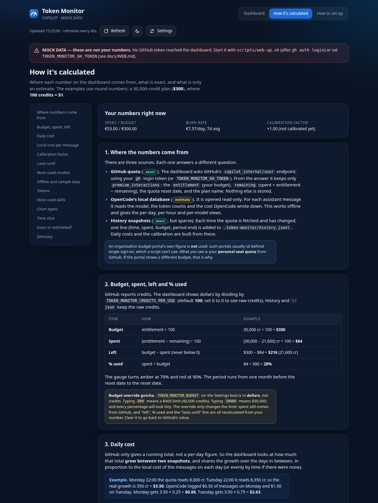

# Token Monitor

A monitor for your **GitHub Copilot premium-request quota** against its monthly budget, with local
usage estimates from [OpenCode](https://opencode.ai). It comes as a browser dashboard (Docker or plain
Python), a native GTK4 app, a GNOME top-bar indicator and a CLI.

- **Quota / budget**: your seat's premium-request quota, read from GitHub in credits and shown in
  dollars (credits ⇄ USD at a configurable rate, 100 credits = $1 by default), with percent used, what is
  left and a "lasts until" forecast.
- **History and offline fallback**: every successful fetch is appended to a local history file; if GitHub
  is unreachable the last snapshot is shown, labelled stale, with a local estimate on top.
- **Local usage (no network)**: tokens, estimated cost, models and skills per day and per hour, read
  read-only from OpenCode's SQLite database.
- **Charts**: tokens and cost per day / per hour, spend vs. budget with a projection, most used models and
  skills; Bar / Line / Dots / Pie chart types; 24h to 30-day ranges plus a free **time slice** over the
  hourly charts; light and dark themes (blue palette).
- **In-app explanation**: the web dashboard has a "How it's calculated" page, and
  [docs/HOW-IT-WORKS.md](docs/HOW-IT-WORKS.md) covers the same ground.

> Forked from [Cividati/ammeter](https://github.com/Cividati/ammeter) (MIT). See
> [Differences from ammeter](#differences-from-ammeter).

## Screenshots

<p>


</p>

<p>


</p>

*The web dashboard in dark and light themes, its usage cards, and the "How it's calculated" tab.
All four captures use the built-in **sample data** (hence the euro amounts and the MOCK DATA banner),
not real usage.*

## Quick start

Requirements: Linux, Python 3.10+, and the [GitHub CLI](https://cli.github.com) (`gh`) logged in
(`gh auth login`), or a token in `TOKEN_MONITOR_GH_TOKEN`. Without either you get clearly labelled mock
data.

### Web dashboard (Docker)

```sh
scripts/web-up.sh -d          # takes your token from `gh`, builds and starts the container
# open http://localhost:8080
```

It listens on `127.0.0.1` only, uses host networking by default (so a VPN-only GitHub Enterprise host is
reachable; `--bridge` opts out), reads your OpenCode folder read-only, and shares this checkout's
`.token-monitor/` history. Without Docker: `python3 -m token_monitor.web --host 127.0.0.1 --port 8080`.
Details, API and troubleshooting: [docs/WEB.md](docs/WEB.md).

### CLI

```sh
python3 bin/token-monitor --text      # plain snapshot
python3 bin/token-monitor --json      # machine-readable (what the GNOME extension reads)
python3 bin/token-monitor --plot      # write .token-monitor/usage.svg (--out FILE)
python3 bin/token-monitor --float     # frameless always-on-top tkinter window (needs python3-tk)
python3 bin/token-monitor --selftest  # checks, no network
```

### GTK app and GNOME top bar (from a checkout)

Needs PyGObject with `Gtk-4.0` and `Adw-1.0` (GTK 4.14+ for the live charts).

```sh
./scripts/install.sh          # symlinks the command, desktop entry, icon and GNOME extension
token-monitor                 # or launch "Token Monitor" from the app grid
./scripts/install.sh --undo   # remove everything again
```

The links point into the checkout, so edits take effect at once. The GNOME extension
(`token-monitor@local`, GNOME Shell 45–50) needs a log out / log in to load on Wayland. The extension runs `~/.local/bin/token-monitor` (or `/usr/bin/token-monitor` when the .deb is installed).

### Debian / Ubuntu package

```sh
./packaging/build-deb.sh                       # writes dist/token-monitor_<version>_all.deb
sudo apt install ./dist/token-monitor_0.1.0_all.deb
```

The package installs the app under `/usr/lib/token-monitor`, the `token-monitor` command, the desktop
entry, the icon and the GNOME extension. The install directory is not writable, so a `.env` next to the
code does not work there: put settings in `~/.config/token-monitor/config`. History is kept in
`~/.local/share/token-monitor/` automatically when the code directory is read-only (override with
`TOKEN_MONITOR_HISTORY_DIR`).

## Setup with an agent

Paste this into a coding agent (OpenCode, Claude Code, Codex, ...) opened in the folder where you want the
project. Replace `<GITHUB_HOST>` with your GitHub Enterprise host, or write `github.com`.

````text
Set up https://github.com/Cividati/token-monitor on this machine and get the web dashboard running.

1. Check the prerequisites and tell me what is missing before installing anything:
   Linux, git, Docker with the compose plugin (or Python 3.10+ if Docker is not available), and the
   GitHub CLI (`gh`). If I need the VPN for <GITHUB_HOST>, tell me to connect it.
2. Clone the repo into ./token-monitor and cd into it.
3. Check `gh auth status -h <GITHUB_HOST>`. If I am not logged in, stop and ask me to run
   `gh auth login -h <GITHUB_HOST>` myself. Never ask me to paste a token into the chat.
4. If <GITHUB_HOST> is not github.com, copy `.env.example` to `.env`, run `chmod 600 .env`, and set
   `TOKEN_MONITOR_GH_HOST=<GITHUB_HOST>`. Do not set `TOKEN_MONITOR_BUDGET`: it overrides the real budget.
5. Run `python3 bin/token-monitor --selftest` (expect "selftest ok"), then `python3 bin/token-monitor --text`.
   The first line should name the plan, not "mock data".
6. Start the dashboard with `scripts/web-up.sh -d` (or `python3 -m token_monitor.web --host 127.0.0.1
   --port 8080` without Docker). Then check `curl -s http://localhost:8080/api/data`: the provider
   must have `"mock": false`.
7. Report: the dashboard URL, the spent / budget / left figures, and anything that looked wrong.

Rules: never print, log or commit a token. Do not commit `.env` or `.token-monitor/`. Keep the dashboard on
127.0.0.1: it has no authentication. Ask before changing anything outside the project folder.

If something fails: a red MOCK DATA banner means no token reached the app (log in with `gh`, then rerun
`scripts/web-up.sh -d`); a 401 means an expired login (`gh auth refresh -h <GITHUB_HOST>`); an offline
banner means <GITHUB_HOST> is unreachable (VPN); empty charts mean the OpenCode database was not found
(`TOKEN_MONITOR_OPENCODE_DB`). More in docs/WEB.md and the in-app "How to set up" page.
````

## Configuration

Copy `.env.example` to `.env` (`chmod 600`) and edit; every setting is optional.

| Setting | Meaning |
|---|---|
| `TOKEN_MONITOR_SOURCE` | `github` (default when a token or `gh` login is usable), `curl` or `mock` |
| `TOKEN_MONITOR_GH_HOST` | GitHub host for the `github` source (default `github.com`; for GitHub Enterprise e.g. `github.example.com`) |
| `TOKEN_MONITOR_GH_TOKEN` | token to use instead of `gh auth token -h <host>` |
| `TOKEN_MONITOR_CREDITS_PER_USD` | `github` source: credits per dollar (default 100; `0` shows raw credits) |
| `TOKEN_MONITOR_UNIT` | unit label when the source names none (`cr` for github, `EUR` otherwise) |
| `TOKEN_MONITOR_BUDGET` | budget limit in the displayed unit (USD for github); overrides the source's. Also settable in the Settings tab / drawer |
| `TOKEN_MONITOR_CURL_CMD` | `curl` source: shell command printing the JSON (else `~/.config/token-monitor/curl.sh`) |
| `TOKEN_MONITOR_JSON_MAP` | `curl` source: `budget=path,spent=path,currency=path,period_end=path` (dotted paths) |
| `TOKEN_MONITOR_HISTORY_DIR` | where `history.jsonl` and `usage.svg` go (default `./.token-monitor` in the checkout) |
| `TOKEN_MONITOR_USAGE` | local usage: `opencode` (default with `github`/`curl`) or `mock` (default with `mock`) |
| `TOKEN_MONITOR_OPENCODE_DB` | OpenCode database path (default `~/.local/share/opencode/opencode.db`) |
| `TOKEN_MONITOR_PROVIDERS` | OpenCode providers counted, comma-separated (default `github-copilot`) |
| `TOKEN_MONITOR_COST_FACTOR` | multiplier for OpenCode's cost estimate; unset = calibrated from history, else 1 |
| `TOKEN_MONITOR_PORT` | web dashboard in Docker: host port (default 8080) |

**Lookup order, first match wins:** real environment variables, then `.env` in the repo root (never
overrides the environment), then `~/.config/token-monitor/config` (same `KEY=VALUE` format), then the
default. Docker-only variables (`OPENCODE_DATA_DIR`, `HOST_UID`, `HOST_GID`, `TZ`) are in
[docs/WEB.md](docs/WEB.md). Hidden providers/models are stored in `~/.config/token-monitor/hidden.json`.

## Data sources and accuracy

| Data | Source | Accuracy |
|---|---|---|
| Quota, spend, reset date | `GET https://api.<host>/copilot_internal/user` (`github` source), with your `gh` token | **Exact** for your personal seat. Spend is `entitlement − remaining`; the API's `credits_used` lags slightly and is only a fallback. An undocumented endpoint, it may change. |
| Same, from an organisation portal | a request you capture and replay (`curl` source, [docs/WIRING.md](docs/WIRING.md)) | Exact as far as the portal is; the SSO cookie expires. |
| Daily spend | difference between consecutive history snapshots of one period | **Exact** for intervals the app was running (spread over the days by local cost, or by time). Nothing before the first snapshot. |
| Tokens, models, skills, messages | OpenCode database, read-only | Exact counts, **only for what OpenCode saw**. Other Copilot clients count towards the quota but have no breakdown. |
| Cost per day / hour / model | OpenCode's own USD estimate × a cost factor | **Estimate**, not billed credits. The factor is `TOKEN_MONITOR_COST_FACTOR`, else calibrated against the exact deltas (once ≥ $1 of local cost is matched), else 1. Hourly views are estimate-only. |
| Offline numbers | last history snapshot + local cost since | Labelled "offline — last portal data … ago" with `~` estimate marks. |
| Mock data | `data/mock-*.json` | Fake; labelled "mock data" (red banner on the web). Used only when there is no token, no `gh` login and no history. |

The quota is **your personal seat quota** (shared by every Copilot client: editors, CLI, OpenCode, …),
not necessarily an organisation budget. Chat and completions are unlimited on the seat and ignored.

## How the numbers are computed

In short: the quota API gives a running total; the history turns snapshots into exact daily deltas;
OpenCode's local cost estimate fills the gaps and is scaled to the exact numbers by a calibration factor;
the burn rate behind "lasts until" is the average daily cost of the last 7 days (when local usage explains
at least half of the period's spend, else the period average). Read
[docs/HOW-IT-WORKS.md](docs/HOW-IT-WORKS.md), or the **How it's calculated** page of the web dashboard
(`/#how`), which has worked examples and a glossary.

## Security notes

- The web dashboard has **no authentication**. Anyone who can open it can read your usage and change its
  settings. The compose file publishes it on `127.0.0.1` only; do not expose it to a LAN or the internet.
- The GitHub token is read at each refresh, sent only to the configured host's API, and never printed,
  logged, returned by the API or stored. Of the response only numbers and the plan name are kept (no
  login, email, id or avatar).
- The OpenCode database is opened read-only; no message text is read. The Docker setup mounts the whole
  OpenCode folder read-only (SQLite needs the WAL files), which also exposes OpenCode's own credentials
  file to the container. The app never reads it; see [docs/WEB.md](docs/WEB.md) for how to avoid that.
- A `curl` source holds an SSO cookie in `.env` or `curl.sh`: keep them mode 600 and out of git. `.env` and
  `.token-monitor/` are gitignored.

## Architecture

```
bin/token-monitor          launcher: makes the package importable, hands over to token_monitor.cli
token_monitor/
  __init__.py              version, app id, palette, icon names
  settings.py              environment / .env / config lookup
  history.py               append-only snapshots (.token-monitor/history.jsonl)
  usage.py                 OpenCode SQLite -> per-day/hour tokens, cost, models, skills; calibration
  providers.py             Copilot sources: github, curl, mock; offline fallback; "lasts until" row
  core.py                  collect(), row schema, stale handling
  filters.py               hidden providers/models (hidden.json)
  cache.py                 last-good cache on disk
  formatting.py            pure helpers: bars, reset times, severities, error wording
  plot.py                  hand-built SVG report (--plot)
  chart_math.py, charts.py chart helpers (pure) and GTK live charts
  cli.py, __main__.py      arguments, --text/--json/--selftest, launches a front-end
  gtk_app.py, ui.css       GTK4 + libadwaita app
  float_window.py          tkinter always-on-top window
  web.py, web/             stdlib HTTP server and the dashboard (index.html, app.js, style.css, theme.js)
  selftest.py              the checks behind --selftest
gnome-extension/           top-bar indicator (uuid token-monitor@local)
data/                      desktop entry, icons, mock-budget.json, mock-history.json
docs/                      HOW-IT-WORKS.md, WEB.md, WIRING.md, RELEASING.md, screenshots
scripts/                   install.sh, web-up.sh, enable-extension.py, grab-x11.py
packaging/build-deb.sh     .deb builder
tests/                     test-format.js (gjs), icon-check.py
Dockerfile, docker-compose*.yml, .env.example
```

The data layer is stdlib-only; dependencies point one way: `formatting`, `settings` ← `history`, `usage` ←
`providers` ← `core` ← `cli` / front-ends.

## Tests

```sh
python3 bin/token-monitor --selftest   # pure Python, no network
gjs -m tests/test-format.js            # GNOME extension formatting against the real --json output
node --check token_monitor/web/app.js  # syntax check of the dashboard script
/usr/bin/python3 tests/icon-check.py   # svgs parse; icon names resolve (needs a display)
```

## Limitations

- The quota is your **personal seat quota**, not an organisation budget, and comes from an undocumented
  GitHub endpoint that may change.
- Cost and per-model figures are **estimates** based on OpenCode's cost data; only OpenCode usage is
  broken down.
- Exact daily spend starts at the first recorded snapshot; run the app regularly to collect more.
- No authentication on the web dashboard (localhost only by design).
- Linux / GNOME focus. GTK4 cannot pin a window on Wayland, so `--float` (tkinter, via XWayland) is the
  always-on-top option. The `.deb` is only built and tested on Debian/Ubuntu-style systems.
- The `curl` source is not available inside the Docker image (no `curl` in the slim image).

## Differences from ammeter

[ammeter](https://github.com/Cividati/ammeter) monitors several AI providers. Token Monitor keeps the
app shell, caching and front-ends but **removed the Claude, Codex, OpenRouter and DeepSeek providers** and
their icons; it is Copilot-only and adds the credits⇄USD view, history and offline fallback, local
OpenCode usage, the web dashboard, charts, models/skills rankings and hourly views.

## Credits and licence

Forked from [Cividati/ammeter](https://github.com/Cividati/ammeter). MIT, see [LICENSE](LICENSE). The icons
in `data/icons/` (the app icon and a generic helmet-style symbolic icon) are drawn for this project; no third-party
icon sets are shipped, and the removed providers' icons are gone. GitHub Copilot is a trademark of its owner, used only to identify what is measured.
